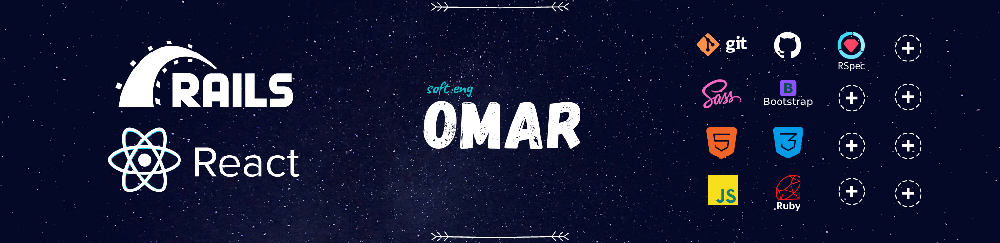

 

## 🚴 Latest activity  🚴
 

| Order ↓ | Technologies | Collaborated w/ | Link |
| ------------- |:-------------:|:-----:|:-----:|
| Front-end exercises :   - [NYtimes.com Clone](https://github.com/elisha2kyakpo1/New-york-times-Milestone)   - [TNW.com Clone](https://github.com/Zappat0n/TNW-clone)   - [Newsweek Clone](https://github.com/od-c0d3r/newsweek-clone)  |                |  [@elisha2kyakpo1](https://github.com/elisha2kyakpo1)   [@Zappat0n](https://github.com/Zappat0n)   [@apricot12](https://github.com/apricot12) |   [Live demo](https://nobbier-pencils.000webhostapp.com/)    [Live demo](https://zappat0n.github.io/TNW-clone/)   [Live demo](https://od-c0d3r.github.io/newsweek-clone/) |
| Ruby exercises :   - [Sorting Algorithm](https://github.com/od-c0d3r/bubble-sort)  - [Enumerable Methods](https://github.com/wandji20/Enumerables-) - [TicTacToe Game](https://github.com/iam-Akshat/ruby-tic-tac-toe) - [TicTacToe Game](https://github.com/od-c0d3r/TicTacToe) |      |  [@wandji20](https://github.com/wandji20) [@wandji20](https://github.com/wandji20) [@iam-Akshat](https://github.com/iam-Akshat) Solo |   [Live demo](https://repl.it/@OmarRashad/Project-Bubble-Sorting-Algorithm) [Live demo](https://repl.it/@OmarRashad/Project-Enumerables) [Live demo](https://repl.it/@OmarRashad/ruby-tic-tac-toe#READ-ME.md) [Live demo](https://repl.it/@OmarRashad/TicTacToa-v10#main.rb) |
|- [Enumerable w/ RSpec](https://github.com/od-c0d3r/Enumerables-/tree/adding-tests) - [TicTacToe w/ RSpec](https://github.com/Rayan84/tic-tac-toe/tree/feature/adding_tests)   - [Mastermind Game w/ RSpec](https://github.com/od-c0d3r/Mastermind-Game) | |[@Rayan84](https://github.com/Rayan84) [@Rayan84](https://github.com/Rayan84)   Solo | [Live demo](https://repl.it/@OmarRashad/Enumerables-) [Live demo](https://repl.it/@OmarRashad/tic-tac-toe)   [Live demo](https://repl.it/@OmarRashad/Mastermind-Game) |
| Cool projects : [High Mountain Bootcamp](https://github.com/od-c0d3r/highmount)    [Ibn-Hayyan Data Miner](https://github.com/od-c0d3r/IbnHayyan-DataMiner)    [RuboFit telegram Bot](https://github.com/od-c0d3r/RuboFitBot) |            | Solo |   [Live demo](https://od-c0d3r.github.io/highmount/)   [Live demo](https://repl.it/@OmarRashad/Ibn-Hayyan-Data-Miner)   [RuboFitBot](https://telegram.me/RuboFitBot) |
| More  | Coming | So. | .on |

