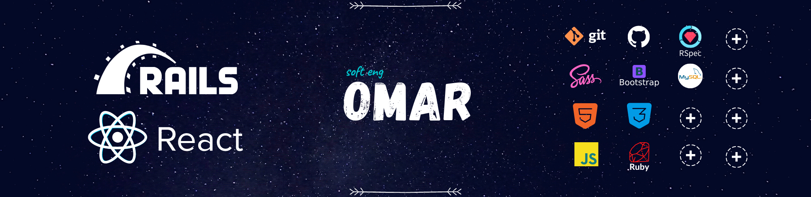

## 🚴  Latest activity  🚴

| Project | Technologies | Collaborated w/ | Link |
| ------------- |:-------------:|:-----:|:-----:|
|Ruby exercises :   - [TicTacToe Game](https://github.com/iam-Akshat/ruby-tic-tac-toe) - [TicTacToe Game](https://github.com/od-c0d3r/TicTacToe) |    | [@iam-Akshat](https://github.com/iam-Akshat) Solo|[Live](https://repl.it/@OmarRashad/ruby-tic-tac-toe#READ-ME.md) [Live](https://repl.it/@OmarRashad/TicTacToa-v10#main.rb) |
|- [Enumerable w/ RSpec](https://github.com/od-c0d3r/Enumerables-/tree/adding-tests) - [TicTacToe w/ RSpec](https://github.com/Rayan84/tic-tac-toe/tree/feature/adding_tests)   - [Mastermind Game w/ RSpec](https://github.com/od-c0d3r/Mastermind-Game) | |[@Rayan84](https://github.com/Rayan84) [@Rayan84](https://github.com/Rayan84)   Solo | [Live](https://repl.it/@OmarRashad/Enumerables-) [Live](https://repl.it/@OmarRashad/tic-tac-toe)   [Live](https://repl.it/@OmarRashad/Mastermind-Game) |
| Ruby On Rails :   - [Members Only](https://github.com/od-c0d3r/members-only)   - [Eventbirte Clone](https://github.com/od-c0d3r/private-events) |  |  [@tanzila-abedin](https://github.com/tanzila-abedin) [@tanzila-abedin](https://github.com/tanzila-abedin) |  [Live](https://github.com/od-c0d3r/members-only) [Live](https://github.com/od-c0d3r/private-events) |
| 💼 :  [High Mountain Bootcamp](https://github.com/od-c0d3r/highmount)    [Ibn-Hayyan Data Miner](https://github.com/od-c0d3r/IbnHayyan-DataMiner)    [RuboFit telegram Bot](https://github.com/od-c0d3r/RuboFitBot)   [RetroJoy Website](https://github.com/od-c0d3r/Retro-Joy) |                 | Solo |   [Live](https://od-c0d3r.github.io/highmount/)   [Live](https://repl.it/@OmarRashad/Ibn-Hayyan-Data-Miner)   [RuboFitBot](https://telegram.me/RuboFitBot)   [Live](https://stunning-kings-canyon-35023.herokuapp.com/) |

⚔      ⚔

